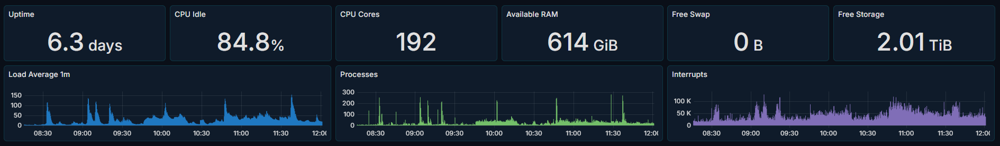
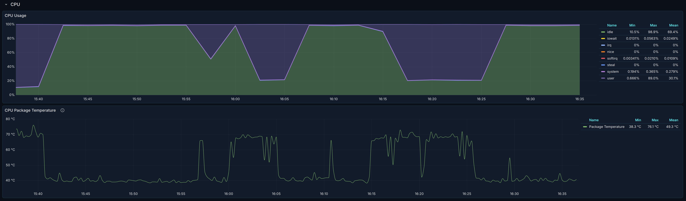
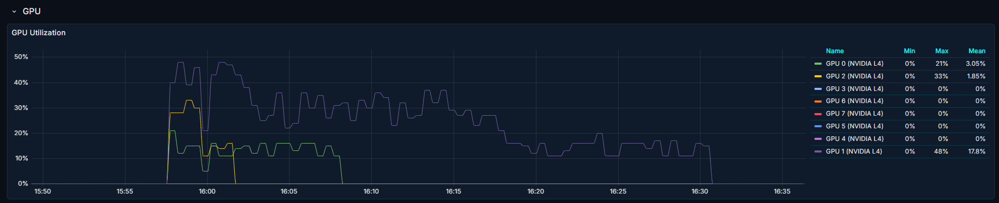
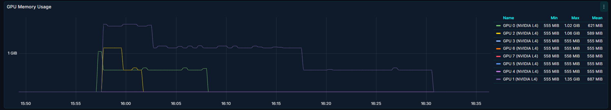
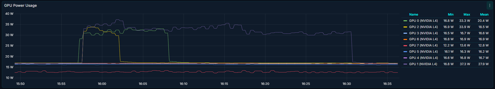
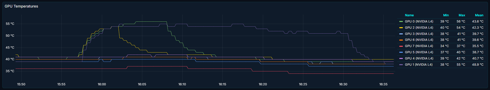
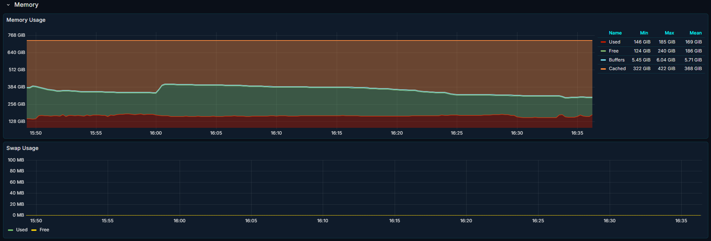
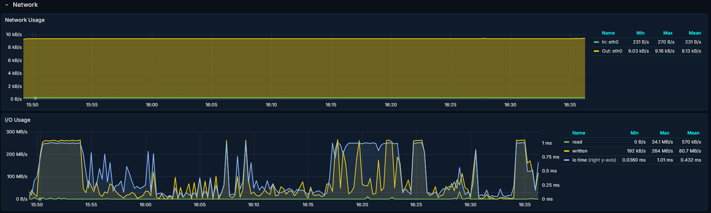
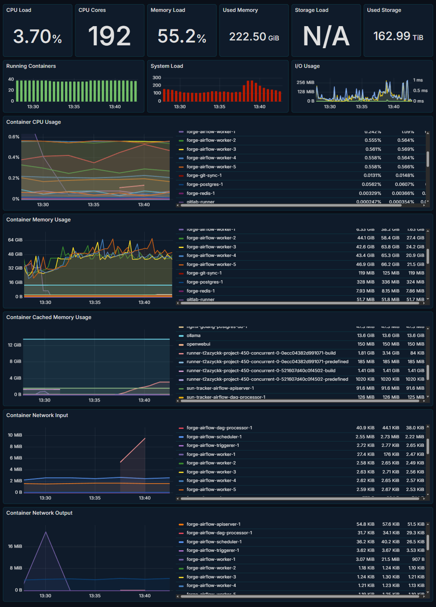

# monitor

This is a fork of [dockprom](https://github.com/stefanprodan/dockprom) that extends the monitoring capability to include GPU metrics as well as some minor aesthetic improvements. Future work will include optional process/task monitoring.

## Quick Start

Make sure you have the following:
* Docker Engine >= 1.13
* Docker Compose >= 1.11


From the repo root, run the following:
```bash
ADMIN_USER='admin' ADMIN_PASSWORD='admin' ADMIN_PASSWORD_HASH='$2a$14$1l.IozJx7xQRVmlkEQ32OeEEfP5mRxTpbDTCTcXRqn19gXD8YK1pO' docker compose up -d
```

Navigate to `http://<host-ip>:3000` (or `localhost:3000`) and login with user ***admin*** password ***admin***. You can change the credentials in the compose file or by supplying the `ADMIN_USER` and `ADMIN_PASSWORD` environment variables on compose up.

Via your browser, select `Dashboards` and now view the various metric dashboards!


## About

This monitoring stack will launch the following containers, note `DCGM exporter` which is the novel addition of GPU metric gathering:
* Prometheus (metrics database) `http://<host-ip>:9090`
* Prometheus-Pushgateway (push acceptor for ephemeral and batch jobs) `http://<host-ip>:9091`
* AlertManager (alerts management) `http://<host-ip>:9093`
* Grafana (visualize metrics) `http://<host-ip>:3000`
* NodeExporter (host metrics collector)
* cAdvisor (containers metrics collector)
* Caddy (reverse proxy and basic auth provider for prometheus and alertmanager)
* DCGM exporter (grabs nvidia GPU metrics and feeds it to prometheus)


## Dashboards

***Host Dashboard***

The Host Dashboard shows key metrics for monitoring the resource usage of your server. Information is divided into panels which you can minimize or maximize:

* Server uptime, CPU idle percent, number of CPU cores, available memory, swap and storage
* System load average graph, running and blocked by IO processes graph, interrupts graph
* CPU usage graph by mode (guest, idle, iowait, irq, nice, softirq, steal, system, user) and CPU Temperatures
  * Please note the CPU package temperature measurement depends on your CPU, for a machine with an intel CPU the `promql` query is: `avg by(instance) (node_hwmon_temp_celsius{chip="pci0000:00_0000:00:18_3", sensor="temp1"})`
  * For a machine with an AMD threadripper: `avg by(instance) (node_hwmon_temp_celsius{chip="pci0000:00_0000:00:18_3", sensor="temp1"})`
* GPU usage, temperatures, power consumption, and memory used
* Memory usage graph by distribution (used, free, buffers, cached)
* IO usage graph (read Bps, read Bps and IO time)
* Network usage graph by device (inbound Bps, Outbound Bps)
* Swap usage and activity graphs











***Docker Containers Dashboard***

The Docker Containers Dashboard shows key metrics for monitoring running containers:

* Total containers CPU load, memory and storage usage
* Running containers graph, system load graph, IO usage graph
* Container CPU usage graph
* Container memory usage graph
* Container cached memory usage graph
* Container network inbound usage graph
* Container network outbound usage graph

Note that this dashboard doesn't show the containers that are part of the monitoring stack.


